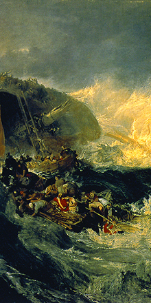
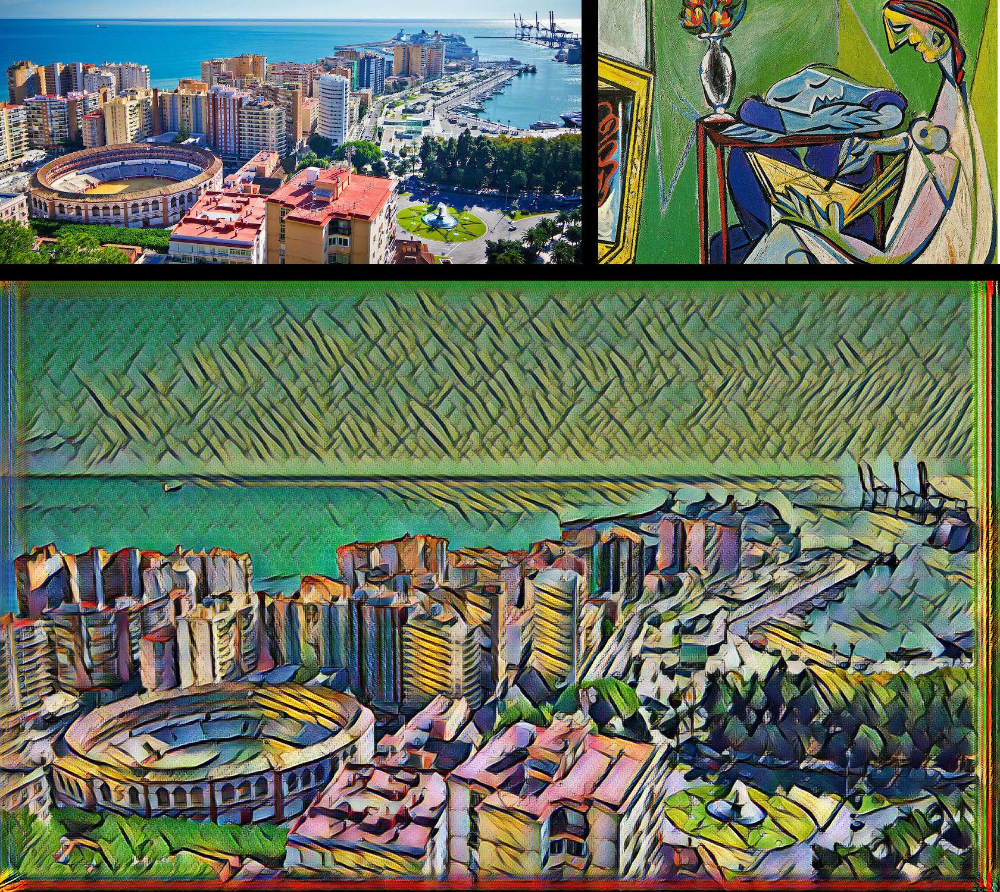

## Style Transfer using TensorFlow
##### December 2017

First and foremost, credit is due to Logan Engstrom for his implementation which is documented on [Github.](https://github.com/lengstrom/fast-style-transfer)

The following is a walkthrough and explanation using much of his code, but focusing on training networks using AWS EC2.

The style transfer of Escher took ~8 hours using an AWS EC2 instance p2.xlarge

If you don't want to train your own network on a new artist's style, there are models already trained for Picasso, Afremov, Munch, Turner, Udnie, and Hokusai:

Here's one I did for Picasso's hometown of Malaga:

Let's get started!

### Requirements
You will need the following:
- TensorFlow 0.11.0
- Python 2.7.9, Pillow 3.4.2, scipy 0.18.1, numpy 1.11.2
- If you want to train:
  - AWS EC2 access / personal GPU
  - All the required NVIDIA software to run TF on a GPU (cuda, etc)
- ffmpeg 3.1.3 if you want to stylize video

## Applying Style Using Pre-trained Model
Use `evaluate.py` to apply style to a picture. In a terminal, run `python evaluate.py` to view all the possible parameters. **Models for evaluation are [located here](https://drive.google.com/drive/folders/0B9jhaT37ydSyRk9UX0wwX3BpMzQ?usp=sharing)**. 

Once you have the correct packages, style can easily be applied by typing in a terminal:

    python evaluate.py --checkpoint ~/downloads/fast-style-transfer/models/udnie.ckpt \
      --in-path ~/downloads/fast-style-transfer/test_imgs/ \
      --out-path ~/downloads/fast-style-transfer/

## Documentation
### Training Style Transfer Networks
Use `style.py` to train a new style transfer network. Run `python style.py` to view all the possible parameters. Training takes 4-6 hours on a Maxwell Titan X. [More detailed documentation here](docs.md#style). **Before you run this, you should run `setup.sh`**. Example usage:

    python style.py --style path/to/style/img.jpg \
      --checkpoint-dir checkpoint/path \
      --test path/to/test/img.jpg \
      --test-dir path/to/test/dir \
      --content-weight 1.5e1 \
      --checkpoint-iterations 1000 \
      --batch-size 20

### Evaluating Style Transfer Networks
